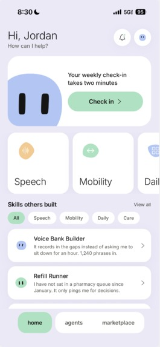
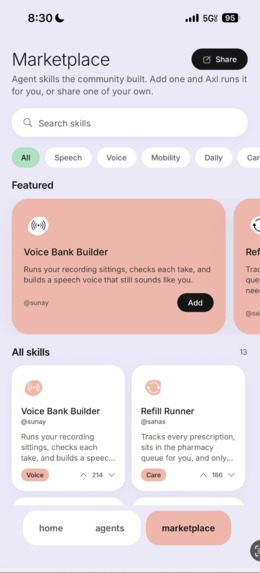
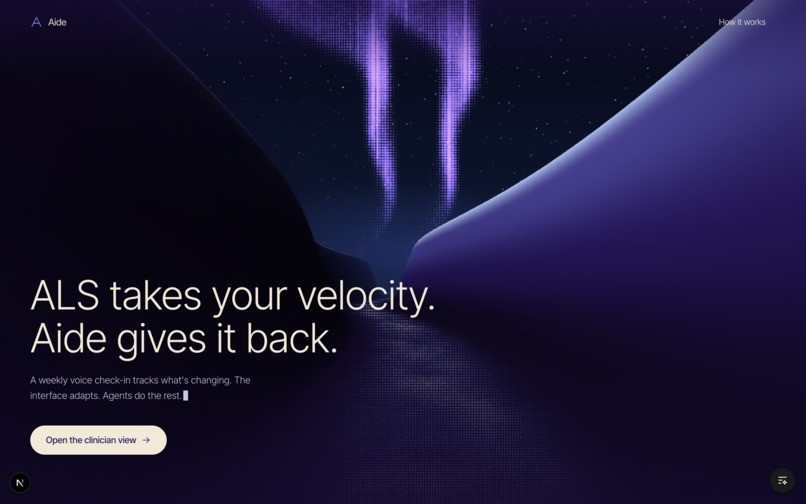
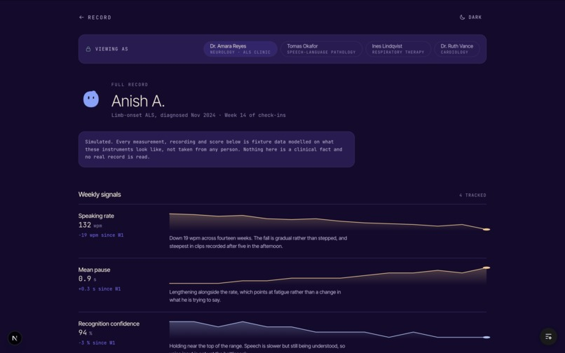

# Aide

An agent for people living with ALS, and a record their clinicians can actually read.

**3rd place overall and 1st place in the Persona track at HackRice 2026.**
[Devpost](https://devpost.com/software/aide)

## Two sides of the same record

ALS takes speech, grip, and mobility on its own schedule. Most tools ask the
person to adapt to a fixed interface, and most clinical check-ins are a
20 minute appointment every three months where someone tries to remember how
the last twelve weeks went.

Aide is built as two surfaces over one record:

**The phone app** is for the person with ALS. An agent called Axl runs the
things that got harder, and a weekly voice check-in takes two minutes. The
interface changes shape as needs change, including a gaze mode for when touch
stops working.

**The clinician view** is the web half. The same check-ins become tracked
signals over time, so a neurologist, an SLP, and a respiratory therapist each
see the part of the record that belongs to them.

Nothing leaves the phone without the person choosing it. Sending a day to a
clinician shows exactly which days and which flagged lines are going, before
they go.

## The phone app

<table>
<tr>
<td width="50%"></td>
<td width="50%"></td>
</tr>
</table>

- **Weekly voice check-in.** Two minutes of talking. The recording is the
  measurement, not a form.
- **Axl.** An agent that runs the skills you have added, answers questions, and
  takes voice notes back and forth.
- **A skills marketplace.** Skills are written by other people with ALS, with
  documentation and a forum where the author answers questions. Voice Bank
  Builder and Refill Runner are the worked examples.
- **A day log.** What changed, what got flagged, and what is worth sending on.
- **Gaze mode.** A second input model for late-stage ALS. Targets are 88pt with
  a full degree of gap so a dwell cannot land between two of them, dwell is
  600ms, and motion is off. Those numbers come from the eye tracking ergonomics
  work, not from taste.

## The clinician view





- **Weekly signals.** Speaking rate, mean pause, recognition confidence, each
  with the trend since week one and a plain sentence about what the shape
  means.
- **Viewing as.** The same record filtered for neurology, speech-language
  pathology, respiratory therapy, or cardiology. A respiratory therapist does
  not need to scroll past speech metrics to find the thing they track.
- **Honest about its own data.** The demo record is fixture data modelled on
  what these instruments look like, and the page says so on the page rather
  than in a footnote.

## Stack

| Piece | What it is |
|---|---|
| Phone app | React Native and Expo SDK 57, iOS first |
| Clinician view | Next.js App Router, React 19, Tailwind |
| Backend | FastAPI on Python 3.12 |
| Auth | Appwrite |
| Identity | Persona, with the verification route picked from what the person can actually do |
| Agent avatars | blobatar, driven by Reanimated on the UI thread |

## Run it

The phone app:

```bash
npm install
npx expo start
```

Open it in Expo Go. Everything runs there, no development build needed, though
SF Symbols and the gyroscope are iOS only.

The web half, from the repo root:

```bash
uv sync && uv run uvicorn app.main:app --reload
cd frontend && npm install && npm run dev
```

The API comes up on `:8000` with docs at `/docs`, the web app on `:3000`.

## Repo layout

```
App.js              Phone app: tab navigator and the auth gate
screens/            Home, Agents, Marketplace, Gaze, Profile, auth
components/         Axl, the sidebar, voice capture, the design primitives
data/               Skills, day log, phrases, profile
lib/                Appwrite and Persona
theme.js            Four accents, two grounds, one type scale

frontend/           Clinician view and landing, Next.js App Router
backend/            FastAPI, plus the agent bridge
deploy/             nginx and tunnel config for the hosted demo
```
